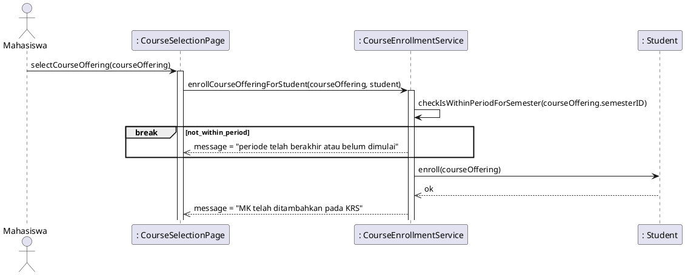

# Unit Test Derivation Protocol

## Overview

This skill implements the 5-stage Test-First Protocol from:

> M. R. K. Pratama, D. Utama, R. Fahmi, "Test-First Protocol for Deriving Unit Tests from Use Case Specifications," _JNTETI_, vol. 15, no. 1, pp. 72–80, Feb. 2026.  
> DOI: [10.22146/jnteti.v15i1.24073](https://doi.org/10.22146/jnteti.v15i1.24073)  
> Link: [https://journal.ugm.ac.id/v3/JNTETI/article/view/24073](https://journal.ugm.ac.id/v3/JNTETI/article/view/24073)

The protocol transforms a plain-language case study narrative (Stage 0) into
coverage-aware, fully traceable unit test scenarios (Stage 5) through five
sequential artifact-producing stages.

**Repository reference**: https://github.com/99ridho/unit-test-derivation-training

---

## Input

The user provides a **case study narrative** — a plain-language description of
a system feature written in Indonesian or English. It must describe:

- The actor(s) involved
- The sequence of checks or validations the system performs
- The success outcome (happy path)
- The failure outcomes for each check (alternate flows)

If any of these elements are missing, ask the user to complete them before
proceeding.

---

## Execution Rules

1. **Execute stages sequentially.** Do not skip, merge, or reorder stages.
2. **Label each stage explicitly** before outputting its artifact.
3. **Do not proceed to the next stage** if the current stage output contains
   a broken traceability link. Flag it and ask the user to confirm or correct.
4. **Language**: Write artifact content in **Indonesian** by default unless the
   user specifies otherwise. Class names, method names, and field names always
   use **English** (camelCase / PascalCase).
5. After Stage 5, output a **Traceability Summary Table**.

---

## Stage 0 — Case Study Narrative (Input Validation)

**This is the user's input, not a generated artifact.**

Before running Stage 1, verify the narrative contains:

- [ ] At least one actor
- [ ] At least one sequential conditional check
- [ ] A defined happy-path outcome
- [ ] At least one alternate-flow outcome per check

If any item is missing, ask the user to supply it. Do not infer or fabricate
conditions that are not stated in the narrative.

**Example of a valid narrative** (from the reference repo):

> Ketika mahasiswa mengajukan penambahan suatu mata kuliah, sistem melakukan
> serangkaian pemeriksaan secara berurutan: (1) verifikasi periode KRS,
> (2) pemenuhan prasyarat, (3) batas maksimal SKS, (4) konflik jadwal.
> Apabila seluruh pemeriksaan berhasil, sistem mencatat mata kuliah ke KRS.

---

## Stage 1 — Use Case Specification

**Output file**: `1-use-case-description.md`

**Goal**: Formalize the narrative into a structured use case description with
a normal flow and explicit alternate flows.

### Output Format

```markdown
# Use Case Description

## Normal flow

1. [Actor] melakukan [action]
2. Sistem memproses [input]
3. Sistem melakukan pengecekan [condition A], [condition B], ... secara sekuensial
4. Sistem [success action]
5. [Actor] mendapatkan [confirmation]

## Alternate flow

1. Jika [condition A fails]: sistem memberikan pesan "[exact error message A]"
2. Jika [condition B fails]: sistem memberikan pesan "[exact error message B]"
   ...
```

### Rules

- Each alternate flow item maps to **exactly one** conditional check from the narrative.
- Steps are written from the **system's perspective**: "Sistem memeriksa...",
  "Sistem menambahkan..."
- Do not merge two conditions into one alternate flow item.
- The exact wording of error messages in alternate flows **must be preserved**
  in Stage 5 Assert blocks.
- Order of alternate flows must match the sequential order of checks in the narrative.

---

## Stage 2 — Sequence Diagram

**Output file**: `2-sequence-diagram.puml`

**Goal**: Model behavioral interaction between actors and system components as
a PlantUML sequence diagram.

### Output Format

Valid `.puml` PlantUML syntax using `@startuml` / `@enduml`.

### Rules

- Use `break` blocks (not `alt/else`) for guard-clause-style early exits,
  consistent with the reference implementation.
- Each alternate flow condition from Stage 1 maps to **exactly one** `break` block.
- `break` blocks must appear in the **same order** as alternate flows in Stage 1.
- Identify at least:
  - One **actor** (e.g., `actor "Mahasiswa" as student`)
  - One **UI/page participant** (e.g., `": SomePage" as page`)
  - One **service class** (e.g., `": SomeService" as service`)
  - One or more **domain entity participants** (e.g., `": Student" as studentEnt`)
- Use `activate` / `deactivate` for service and entity lifelines.
- The happy path (all checks pass) ends with a success message returned to the page.
- Use `skinparam` or `!theme` for styling only; avoid inline color hacks.
- The diagram must be self-contained and renderable without external includes.

### Reference Example



---

## Stage 3 — Algorithm / Pseudocode

**Output file**: `3-algorithm.txt`

**Goal**: Extract the internal logic of the primary service method as structured
pseudocode, directly derived from the sequence diagram.

### Output Format

```
class [ServiceClassName] {
  function [methodName]([params]) {
    [variable] = [check or query]
    if ![condition] {
      return "[error message from Stage 1]"
    }

    ' ... repeat per guard clause

    [success action]
    return "[success message from Stage 1]"
  }
}
```

### Rules

- Represent each conditional check as an explicit `if !condition { return }` guard clause.
- Guard clauses must appear in the **same sequential order** as Stage 1 alternate flows
  and Stage 2 `break` blocks.
- The happy path (all checks pass) is the **last block**, ending with a success return.
- Method name must be **consistent** with Stage 2 (e.g., `enrollCourseOfferingForStudent`).
- Use language-neutral pseudocode — no Python, Java, or Swift-specific syntax.
- Error return messages must **exactly match** the wording established in Stage 1.
- Each guard clause variable should be named meaningfully
  (e.g., `isWithinPeriod`, `prerequisiteFound`, `limitExceeded`, `overlapFound`).

---

## Stage 4 — Control Flow Graph + Cyclomatic Complexity

**Output**: Inline textual CFG description + CCN calculation + basis path enumeration.

**Goal**: Construct the CFG from Stage 3 pseudocode, calculate McCabe's cyclomatic
complexity, and enumerate all independent basis paths.

### CFG Construction Rules

- Each **guard clause** `if condition { return }` = one **decision node** with
  two outgoing edges:
  - TRUE edge → early return node
  - FALSE edge → next node
- The **happy path** is the path where all conditions evaluate to FALSE
  (no early exits triggered).
- Terminal nodes: one per early return + one for the success return.

### CCN Calculation

Use the formula:

```
CCN = number_of_decision_nodes + 1
```

Equivalently: `CCN = E − N + 2P` where E = edges, N = nodes, P = connected components (= 1).

The number of decision nodes equals the number of guard clauses in Stage 3.

### Basis Path Enumeration

List exactly CCN paths. Label them Path 1, Path 2, ..., Path N.

For each path, state:

- Which condition(s) are evaluated
- Which condition triggers the exit (for alternate paths), or that all pass (happy path)
- The return message

**Example** (for 4 guard clauses, CCN = 5):

```
Path 1: Guard 1 TRUE → exit ("periode telah berakhir")
Path 2: Guard 1 FALSE, Guard 2 TRUE → exit ("MK prasyarat belum diambil")
Path 3: Guard 1 FALSE, Guard 2 FALSE, Guard 3 TRUE → exit ("SKS telah mencapai batas maksimal")
Path 4: Guard 1 FALSE, Guard 2 FALSE, Guard 3 FALSE, Guard 4 TRUE → exit ("ada jadwal conflict")
Path 5: Guard 1–4 all FALSE → happy path ("MK telah ditambahkan pada KRS")
```

### Validation

- Total basis paths = CCN. If not, recount decision nodes.
- Each basis path must be **distinct** — they must differ in at least one edge traversal.

---

## Stage 5 — Unit Test Scenarios

**Output file**: `5-test-scenario.md`

**Goal**: Derive one AAA-structured unit test scenario per basis path from Stage 4.

### Output Format

````markdown
# Test Suite : [ServiceClassName].[methodName]

## Scenario N: [Short descriptive name]

### Arrange

\```
[Service configuration]
[Input object(s) with all relevant field values]
[Any dependency setup needed to trigger or bypass this specific condition]
\```

### Act

\```
[Single method call on the service under test]
\```

### Assert

\```
message = "[exact message from Stage 1 alternate or normal flow]"
\```
````

### Rules

- **Total scenarios = CCN value from Stage 4.** One scenario per basis path.
  Exactly N scenarios — no more, no less.
- **Arrange** must include all state needed to reach the condition under test:
  - Service-level configuration (e.g., date range, current date)
  - Input objects with all fields populated
  - Any prerequisite objects needed to bypass earlier guard clauses
- Each scenario's Arrange must differ from others in **exactly the variable(s)**
  that trigger or bypass the condition being tested in that scenario.
- **Act** = single method call. No setup logic inside Act.
- **Assert** message must **exactly match** the wording from Stage 1 alternate
  or normal flows. Do not paraphrase.
- Scenario names should identify the condition tested:
  - Alternate path: name of the condition (e.g., "Diluar periode KRS")
  - Happy path: "Happy flow"
- Use a **consistent object model** across all scenarios:
  same class names, same field names, same value types.

### Arrange Construction Guidance per Scenario

For **Scenario N** (testing guard clause N):

- All guard clauses **before N** must evaluate to FALSE → provide valid data that bypasses them.
- Guard clause **N** must evaluate to TRUE → provide data that triggers the failure.
- All guard clauses **after N** are irrelevant → can be omitted from Arrange.

For the **happy path scenario**:

- All guard clauses must evaluate to FALSE → provide valid data for every check.
- The student must be eligible on all dimensions.

---

## Traceability Summary Table

After completing Stage 5, output this table:

```markdown
## Traceability Summary

| Condition (Stage 0/1)   | Alternate Flow (Stage 1) | break block (Stage 2) | Guard Clause (Stage 3) | CFG Path (Stage 4) | Test Scenario (Stage 5) |
| ----------------------- | ------------------------ | --------------------- | ---------------------- | ------------------ | ----------------------- |
| [narrative condition A] | Alternate flow 1         | break [condition_A]   | if ![varA] { return }  | Path 1             | Scenario 1: [name]      |
| [narrative condition B] | Alternate flow 2         | break [condition_B]   | if ![varB] { return }  | Path 2             | Scenario 2: [name]      |
| ...                     | ...                      | ...                   | ...                    | ...                | ...                     |
| (all pass)              | Normal flow step 4–5     | (no break)            | success return         | Path N             | Scenario N: Happy flow  |
```

Every row must be complete. A missing cell indicates a broken traceability link.

---

## Error Conditions and Flags

Flag and halt (do not continue to the next stage) if any of the following occur:

| Condition                                            | Flag Message                                                            |
| ---------------------------------------------------- | ----------------------------------------------------------------------- |
| Alternate flow count ≠ guard clause count            | `[TRACEABILITY ERROR] Stage 1→3: alternate flow count mismatch`         |
| Guard clause count ≠ `break` block count             | `[TRACEABILITY ERROR] Stage 2→3: break block count mismatch`            |
| Guard clause order differs from alternate flow order | `[TRACEABILITY ERROR] Stage 3: guard clause order must match Stage 1`   |
| CCN ≠ number of basis paths enumerated               | `[TRACEABILITY ERROR] Stage 4: basis path count must equal CCN`         |
| Scenario count ≠ CCN                                 | `[TRACEABILITY ERROR] Stage 5: scenario count must equal CCN`           |
| Assert message does not match Stage 1 wording        | `[TRACEABILITY ERROR] Stage 5→1: Assert message mismatch in Scenario N` |

When a flag is raised, show the specific mismatch and ask the user whether to
correct the source stage or adjust the current stage.

---

## Quick Reference: Stage → Artifact Mapping

| Stage | Artifact                          | Key Constraint                                     |
| ----- | --------------------------------- | -------------------------------------------------- |
| 0     | Case study narrative (user input) | Must have: actor, sequential checks, outcomes      |
| 1     | `1-use-case-description.md`       | One alternate flow per check, exact error messages |
| 2     | `2-sequence-diagram.puml`         | One `break` per alternate flow, same order         |
| 3     | `3-algorithm.txt`                 | One guard clause per `break`, same order           |
| 4     | CFG + CCN + basis paths           | CCN = decision nodes + 1; paths = CCN              |
| 5     | `5-test-scenario.md`              | Scenarios = CCN; Assert = exact Stage 1 message    |

---

## Protocol Citation

When referencing this protocol in research outputs, use:

```
M. R. K. Pratama, D. Utama, and R. Fahmi, "Test-First Protocol for Deriving
Unit Tests from Use Case Specifications," Jurnal Nasional Teknik Elektro dan
Teknologi Informasi, vol. 15, no. 1, pp. 72–80, Feb. 2026.
DOI: 10.22146/jnteti.v15i1.24073
```
